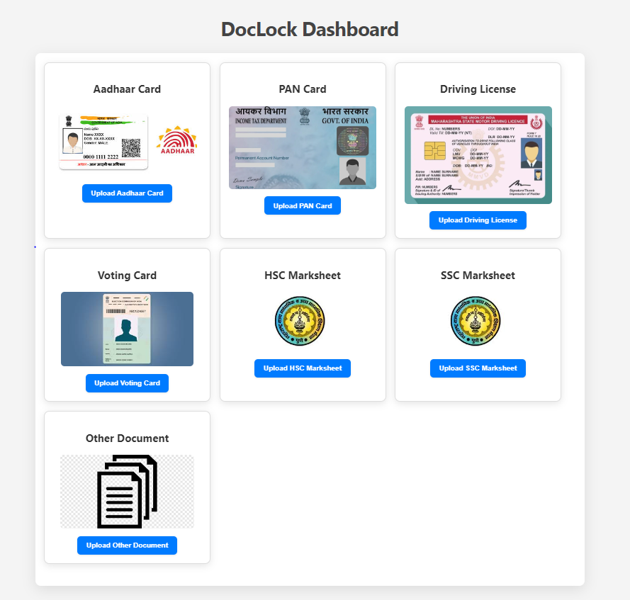

# DocLock

DocLock is a web-based application designed to securely store and manage your personal documents. Inspired by DigiLocker, DocLock aims to provide a simple, yet effective solution for document storage without the need for third-party services.

<!-- Add a screenshot of your app here -->

## Features

- **Secure Document Storage:** Upload and store your documents securely.
- **Responsive Design:** Optimized for both desktop and mobile devices.
- **User-Friendly Interface:** Easy to navigate and manage your documents.
- **Lightweight:** Built using HTML, CSS, and JavaScript for fast performance.
- **Customizable:** Easily modify the app to fit your personal needs.

## Installation

To run the DocLock application locally on your machine, follow these steps:

1. **Clone the Repository:**

   Clone the repository to your local machine using the following command:

   ```bash
   git clone https://github.com/PratikDevelops/doclock.git
   ```

2. **Navigate to the Project Directory:**

   Move into the project directory:

   ```bash
   cd doclock
   ```

3. **Open the Application:**

   Simply open the `index.html` file in your preferred web browser to start using DocLock:

   ```bash
   open index.html
   ```

   Alternatively, you can drag the `index.html` file into your browser window.

## Usage

- **Upload Documents:** Click on the "Upload" button to select and upload documents from your device.
- **View Documents:** View your uploaded documents directly in the app.
- **Manage Documents:** Delete or organize your documents as needed.

## Customization

DocLock is designed to be easily customizable. Here are a few ways you can modify the app:

- **Change the Theme:** Modify the CSS files to change the color scheme and layout to your liking.
- **Add New Features:** Use JavaScript to add new functionalities like encryption, tagging, or advanced search.
- **Integrate with Backend:** Though this version is front-end only, you can integrate it with a backend service (e.g., Node.js, Python, etc.) for more advanced features like user authentication and cloud storage.

## Contributing

We welcome contributions from the community! If you'd like to contribute, please follow these steps:

1. Fork the repository.
2. Create a new branch (`git checkout -b feature-branch`).
3. Make your changes.
4. Commit your changes (`git commit -m 'Add some feature'`).
5. Push to the branch (`git push origin feature-branch`).
6. Open a pull request.

## License

This project is licensed under the MIT License - see the [LICENSE](LICENSE) file for details


## Future Enhancements

Here are some planned features and improvements for future versions:

- **Encryption:** Secure documents with end-to-end encryption.
- **User Authentication:** Implement user login and registration.
- **Cloud Integration:** Store documents in the cloud for access from any device.
- **Sharing Options:** Allow users to share documents securely with others.

## Contact

If you have any questions, issues, or suggestions, feel free to reach out:

- **Email:** kepratik8@gmail.com.com

Thank you for using DocLock!
